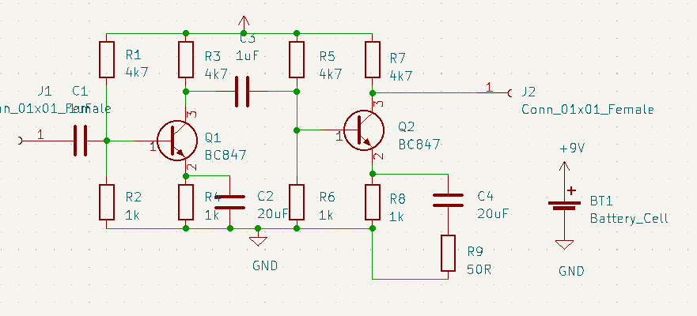
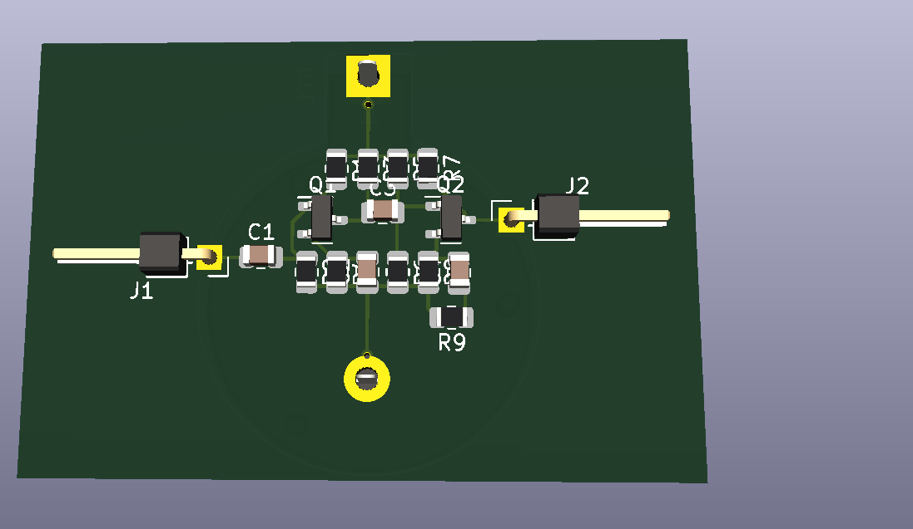
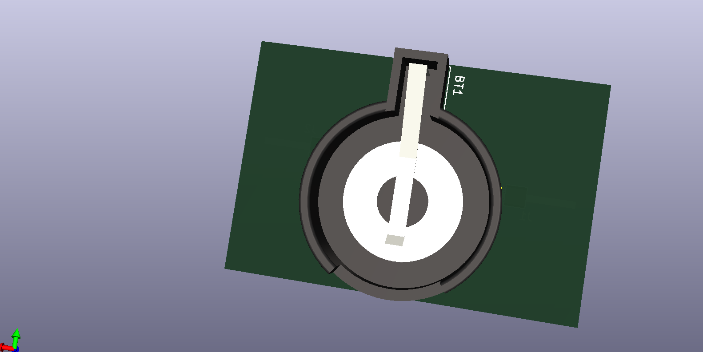

# 2 Stage Amplifier

2 Stage Amplifier using BC847 transistors. All components should be SMD, except for pinheaders and connectors.

Name: Aaron Van Vyve

## Schematic

 

## PCB

| Front | Back |
|---|---|
|   |   |

## BOM

The BOM or Bill of Materials consists out of a list of all the components with some of theire properties. 

| Designator | Quantity | Description | Footprint | Farnell ordercode | Price |
|---|---|---|---|---|---|
| R1, R3, R5, R7 | 4 | 4k7 ohm | 0805 | [1750763](https://be.farnell.com/panasonic/erjp06f4701v/res-4k7-1-0-5w-0805-thick-film/dp/1750763) | 0.101 € (you get 10) | <!-- TODO: remove this example -->
| R2, R4 | 2 | 1k ohm | 0805 | [2861522](https://be.farnell.com/te-connectivity/crgcq0805f1k0/res-1k-1-0805-thick-film/dp/2861522) | 0.0371€ (you get 10) |
| R9 | 1 | 50 ohm | 0805|[2820487RL](https://be.farnell.com/vishay-foil-resistors/y402250r0000a9r/res-50r-0-05-0-2w-0805-metal-foil/dp/2820487RL)|13.18€ (you get 10) |
| Q1, Q2 | 2 | BC847 | 0805|[1081231](https://be.farnell.com/nexperia/bc847a-215/transistor-npn-sot-23/dp/1081231?st=bc847)|0.104€ (you get 5) |
| C1, C3 | 2 | 1uF | 0805|[1890109](https://be.farnell.com/wima/smdtc04100ta00kq00/cap-1-f-63v-10-pet-2824-smd/dp/1890109)|3.50€ |
| C2, C4 | 2 | 20uF | 0805|[C4AEGBU5200A12J](https://be.farnell.com/kemet/c4aegbu5200a12j/cap-20-f-450v-5-pp-radial/dp/2709775)|14.36€ |
| J1, J2 | 2 | Female 1x1 | |[2892466](https://be.farnell.com/amphenol-icc/68000-200hlf/connector-header-1pos-1row/dp/2892466)|0.21€ |
| Battery | 1 | 9V | 0805|[1018880](https://be.farnell.com/panasonic/6f22rel-1bp/battery-zinc-carbon-pp3/dp/1018880)|1.51€ |
Total price: 33.0021€
